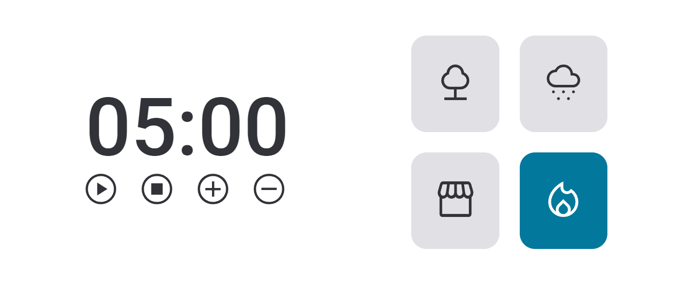

# Explorer - Rocketseat

## FocusTimer 2.0
  Desafio concluido

## Funcionalidades
  - Botão play = inicia timer
  - Botão stop = para o timer e reseta
  - Botão Mais = adiciona 5 minutos do timer
  - Botão Menos = Diminui 5 minutos do timer
  - Cards de sons, sendo eles floresta, chuva, lareira, e cafeteria
  

[🔗 Clique aqui para acessar](https://JMonteiroh.github.io/FocusTimer-2.0/)

## ⚙️ Tecnologias

- HTML
- CSS
- JavaScript
- Git e Github
